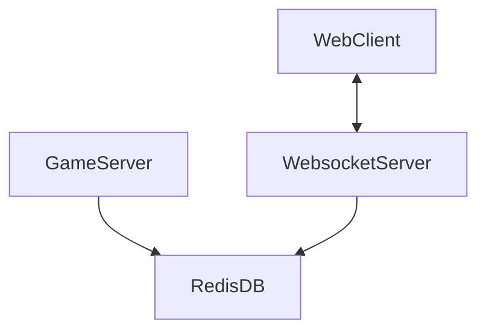

# Hydra web client

## Architecture

## Dependencies
- Scala & sbt
- NodeJS

## Installation instructions

1. Start RedisDB
`redis-server`

2. Start game engine
`sbt run`

3. Start WebSocket server (port 8081)
`node app.js`

4. Open web client in browser
